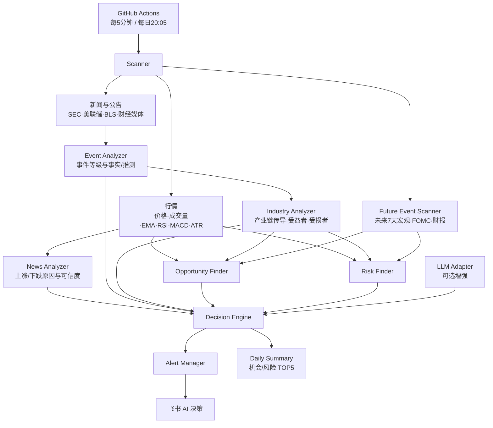
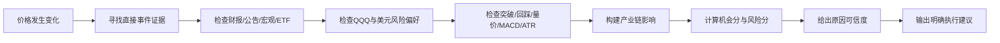

# Investment OS V3

Investment OS V3 是一个持续运行的 **AI 投资决策系统**。

它不是单纯的行情监控、新闻聚合或价格提醒工具。系统每 5 分钟扫描全球资本市场信息，把行情、技术面、公司公告、宏观事件、财报和 AI 产业链放在同一条分析链中，最终回答：

1. 今天发生了什么？
2. 为什么发生？
3. 谁是真正受益者？
4. 谁真正可能受损？
5. 哪个机会最大？
6. 风险在哪里？
7. 现在应该怎么办？

每个资产必须输出一个明确动作：`继续定投`、`等待回踩`、`小额建仓`、`继续持有`、`减仓观察`、`暂停新增`、`不要追高`或`继续观察`。

> 系统只做基于公开信息的辅助分析，不承诺收益。用户只做现货，不使用合约或杠杆。

## 系统架构



## 实时决策流程



价格上涨或下跌本身不会被直接包装成机会。没有可确认事件时，消息会明确写出“暂未发现可确认的直接消息驱动”，并降低原因可信度。

## 监控资产

监控列表全部位于 `config/watchlist.json`：

- BTC
- QQQ
- NVDA
- MSFT
- META
- GOOG
- AMZN
- AVGO
- TSM
- MU
- SNDK

BTC 使用 Binance 的 BTCUSDT 公共现货 K 线作为 BTC 的近似价格代理。股票代码、类型、行情源代码和 SEC CIK 都可直接在配置文件中扩展。

## 监控内容

每轮扫描包括：

- 最新价格及 5 分钟、15 分钟、1 小时、24 小时涨跌幅
- 成交量倍数、放量、缩量
- EMA20、EMA60、EMA200
- RSI
- MACD、信号线、柱状图
- ATR 与 ATR 占价格比例
- 近 20 周期突破、跌破
- 上升趋势中的 EMA20 回踩
- 盘前盘后行情
- SEC 8-K、10-Q、10-K、6-K、20-F
- 美联储、CPI、非农等宏观信息
- BTC ETF 相关消息
- 财报、业绩指引、AI 资本开支
- AI 服务器、GPU、网络、晶圆代工、HBM、SSD 产业链
- 未来 7 天宏观、FOMC 和财报事件

所有数据都带有数据时间。旧行情不会被描述为实时事实；来源失败时写“数据暂不可用”，不会编造。

## 核心模块

| 模块 | 文件 | 职责 |
| --- | --- | --- |
| Scanner | `src/scanner.py` | 并行编排行情、新闻和未来事件扫描 |
| Market Data | `src/market_data.py` | 获取 K 线并计算完整市场快照 |
| News Analyzer | `src/news_analyzer.py` | 分析为什么涨跌并给出原因可信度 |
| Industry Analyzer | `src/industry_analyzer.py` | 识别产业主题、传导链、受益者和受损者 |
| Event Analyzer | `src/event_analyzer.py` | 区分事实与推测，计算一到五星事件等级 |
| Opportunity Finder | `src/opportunity_finder.py` | 提前寻找技术面和产业链二阶受益机会 |
| Risk Finder | `src/risk_finder.py` | 识别趋势、量价、事件和数据时效风险 |
| Future Event Scanner | `src/future_events.py` | 扫描未来 7 天 BLS、FOMC 和财报日历 |
| Decision Engine | `src/decision_engine.py` | 综合全部信息，生成机会/风险 TOP5 和明确动作 |
| Alert Manager | `src/alert_manager.py` | V3 观察阶段将每个资产决策全部发送到飞书 |
| Daily Summary | `src/daily_summary.py` | 每天 20:05 总结机会、风险、产业链和明日事件 |
| LLM Adapter | `src/llm_adapter.py` | 可插拔 OpenAI-compatible/Anthropic 协议接口 |

产业链规则位于 `config/industry_map.json`，LLM 提供商元数据位于 `config/llm_providers.json`。扩展规则不需要改写决策引擎。

## 飞书消息

每个资产每轮输出：

```text
【Investment OS AI】
★★★★★ 机会/风险

资产：
原因：
AI分析：
产业链：
事件：
风险：0~100
机会：0~100
执行建议：
AI一句总结：
```

消息同时显示原因可信度、事件星级、可能受益者、可能受损者、未来事件和技术指标。

## V3 观察模式

当前版本按照需求关闭：

- 同类消息冷却
- 消息频率限制
- Opportunity Score 发送门槛
- Risk Score 发送门槛
- 新闻发送去重

因此实时任务会在每轮向飞书发送全部 11 个资产决策，无论分数高低。状态文件只用于记录发送历史和每日统计，不参与拦截。

这是高消息量模式：理论上每 5 分钟最多发送 11 条、每天最多约 3,168 条。完成观察后，建议基于实际日志恢复分层发送和事件去重。

## GitHub Actions

### 实时 AI 决策

`.github/workflows/realtime-monitor.yml`

- Python 3.12
- `workflow_dispatch` 手动运行
- `*/5 * * * *` 每 5 分钟调度
- 任务超时 2 分钟
- concurrency 防止任务重叠

### 每日决策

`.github/workflows/daily-summary.yml`

- `workflow_dispatch` 手动运行
- `5 12 * * *`，即北京时间每天 20:05
- 输出最大机会、最大风险、TOP5、产业链变化、明日重点和一句总结

GitHub Actions 不是秒级实时系统，计划任务可能因平台负载延迟。

## Secret 与变量配置

进入 GitHub 仓库：

`Settings → Secrets and variables → Actions`

必须配置：

| 类型 | 名称 | 用途 |
| --- | --- | --- |
| Secret | `FEISHU_WEBHOOK` | 飞书自定义机器人 Webhook |

推荐配置：

| 类型 | 名称 | 用途 |
| --- | --- | --- |
| Variable | `SEC_USER_AGENT` | SEC 自动访问标识，建议包含项目名和联系邮箱 |

可选 LLM 配置：

| 类型 | 名称 | 用途 |
| --- | --- | --- |
| Variable | `LLM_PROVIDER` | `openai`、`claude`、`gemini`、`deepseek`、`qwen` 或 `disabled` |
| Variable | `LLM_MODEL` | 具体模型名 |
| Variable | `LLM_BASE_URL` | 可选，自定义兼容网关地址 |
| Secret | `LLM_API_KEY` | LLM 密钥 |

默认 `LLM_PROVIDER=disabled`。不配置 LLM 时系统使用本地可解释规则，所有核心功能仍可运行。密钥、Webhook、Token 和服务响应正文均不会写入日志。

## 本地运行

```bash
python3.12 -m venv .venv
source .venv/bin/activate
pip install -r requirements.txt
pytest -q
python -m src.main --mode realtime --dry-run
python -m src.main --mode daily --dry-run
```

`--dry-run` 会执行真实扫描和完整决策，但不发送飞书。

第一次部署建议：

1. 配置 `FEISHU_WEBHOOK`。
2. 手动运行实时工作流并选择 `dry_run=true`。
3. 核对 11 个资产、机会/风险 TOP5、未来事件数量和数据源失败日志。
4. 再运行 `dry_run=false`、`send_test_message=true` 验证飞书。
5. 关闭测试消息，进入 V3 全量观察。

## 数据源

| 数据 | 来源 |
| --- | --- |
| BTC 现货 K 线 | Binance 公共现货 API |
| 美股、QQQ、美元指数代理 | Yahoo Finance 公共图表接口 |
| 公司公告与财报文件 | SEC EDGAR Submissions API |
| 美联储事件 | Federal Reserve 官方 RSS 与 FOMC 日历 |
| CPI、非农日历 | BLS 官方 RSS 与 iCalendar |
| 未来财报 | Nasdaq 财报日历 |
| 主流财经新闻补充 | Google News RSS，限制主流来源 |

所有 HTTP 请求设置 timeout、retry 和 backoff。单个源失败不会阻断其他数据和决策。

## 如何扩展

### 增加资产

修改 `config/watchlist.json`，确认行情代码和 SEC CIK 后新增条目。

### 增加产业链

修改 `config/industry_map.json`：

- `keywords`：事件识别词
- `industries`：影响行业
- `beneficiaries`：可能受益资产
- `demand_sources`：需求来源
- `chain`：传导链

负面事件不会自动反转成确定性受损结论，只会标记为“可能受损”并保留可信度。

### 增加 LLM 提供商

在 `config/llm_providers.json` 增加提供商，指定：

- `protocol`：`openai_compatible` 或 `anthropic`
- `base_url`

密钥和模型始终由环境变量注入。业务模块只依赖统一的 `LLMAdapter`，不绑定具体厂商。

### 增加事件源

在 `FutureEventScanner` 或 `NewsClient` 中增加独立方法，并保持：

- 超时、重试、退避
- 单源故障隔离
- 来源和发布时间
- 事实与推测分离
- 不记录敏感响应

## 已知限制

- Yahoo Finance 和 Nasdaq 公共接口没有 SLA，可能延迟、限流或改变格式。
- BTCUSDT 与严格意义上的 BTC-USD 存在交易场所及稳定币价差。
- 免费新闻源无法覆盖所有公司公告、ETF 资金流和链上资金；缺失项会降低可信度。
- SEC 表单只能证明文件已提交；系统不会仅凭表单类型判断利好或利空。
- 标题级新闻分析无法替代财报正文和电话会全文。
- 静态产业链图谱表达的是可能的经济传导，不代表实际订单已经发生。
- BLS 在部分地区或云出口可能返回 403；该来源会独立降级。
- LLM 默认关闭；启用后会增加成本、运行时间和第三方数据处理风险。
- V3 全量发送会产生极高消息量，可能触及飞书机器人限流。
- 当前仓库没有配置 GitHub remote，提交默认只存在本地 `main`。

## 暂停任务

进入 GitHub Actions，分别对以下工作流选择 **Disable workflow**：

- `Investment OS V3 AI决策`
- `Investment OS V3 每日决策`
