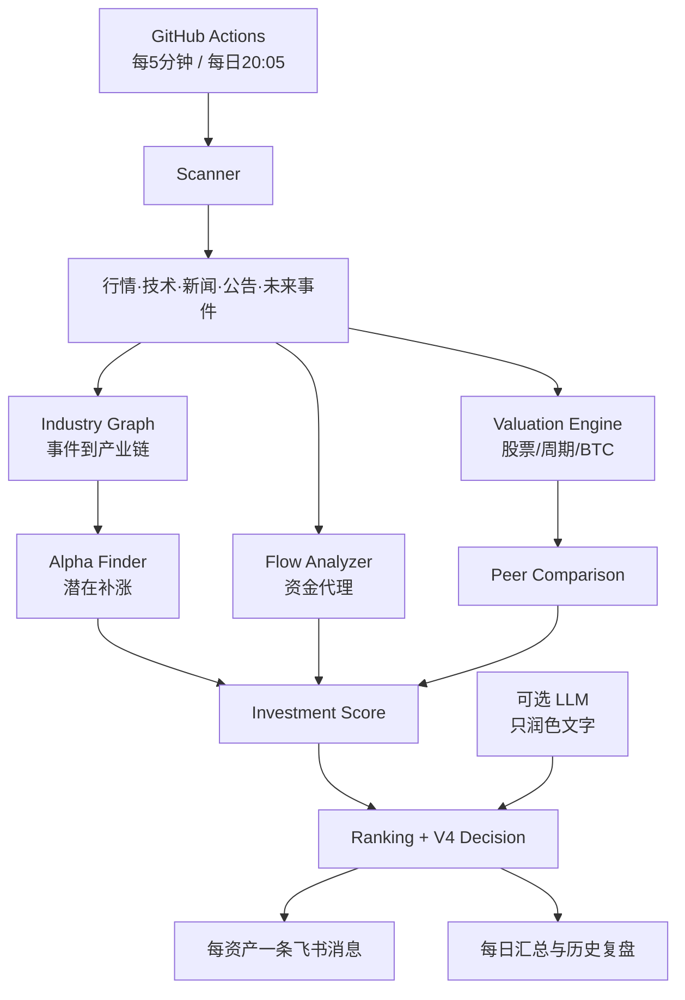
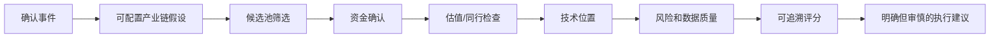

# Investment OS V4

Investment OS V4 是面向小额长期现货投资者的 AI 投资决策系统。它把事件、产业链、候选标的、资金代理、估值、技术位置和风险过滤串成一条可解释决策链，而不是行情提醒、新闻聚合或“预测必涨”工具。

系统不会输出“必涨”“确定翻倍”等结论，不使用合约或杠杆，也不建议重仓押注。默认执行边界是每日约 10 USDT、每月约 300 USDT；数据不足时明确显示“数据暂不可用”并降低置信度。

## 系统架构



## 数据流



产业链映射属于系统推断，不代表订单已经发生。消息将“已确认事实”“系统推断”“暂无法验证”分开显示。

## 主要模块

| 模块 | 职责 |
| --- | --- |
| Scanner | 并行扫描核心资产、候选池、新闻和未来事件 |
| Industry Graph | 通过 YAML 配置事件、行业、业务环节、公司、方向、权重和时滞 |
| Alpha Finder | 区分潜在补涨、弱势未涨和已充分定价 |
| Flow Analyzer | 用相对成交量、OBV、VWAP和成交额代理推断资金；明确数据时效 |
| Valuation Engine | 股票多指标估值、存储周期调整、BTC独立估值 |
| Peer Comparison | 比较增长、质量、估值、动量、资金、风险和数据质量 |
| Investment Score | 规则化计算机会、风险、综合、置信度和数据质量分 |
| Ranking | 生成综合、Alpha、资金、估值、风险和数据不足榜 |
| Replay / Backtest | 事件日切片回放，验证1/5/20日收益及MFE/MAE |
| Alert Manager | 同一轮同一资产合并成一条完整消息 |
| Daily Summary | 北京时间20:05汇总排行榜、复盘、事件日历和定投节奏 |
| LLM Adapter | 可选 OpenAI-compatible/Anthropic 接口，只做文字表达 |

V3 的 `Opportunity Finder`、`Risk Finder`、`Future Event Scanner`、`Decision Engine`、状态缓存及原测试均保留。

## 监控资产与候选池

核心资产位于 `config/watchlist.json`：`BTC-USD`、`QQQ`、`NVDA`、`MSFT`、`META`、`GOOG`、`AMZN`、`AVGO`、`TSM`、`MU`、`SNDK`。

产业链候选位于 `config/candidate_universe.json`，默认覆盖 AI 算力、GPU、ASIC、网络交换、服务器、存储、半导体设备和 BTC 相关股票，最多 50 个。手动标的添加到 `manual_assets`；业务代码不硬编码候选名单。

## 配置产业链和同行组

- `config/industry_graph.yaml`：配置事件关键词、行业、受益/受损环节、标的、权重、影响时滞和假设说明。
- `config/peer_groups.yaml`：配置同类公司组。同行结论只基于可得维度，缺失数据不补造。
- `config/scoring_weights.yaml`：调整评分权重；总和必须为 100。
- `config/valuation_rules.yaml`：调整成长股、周期股和 BTC 估值规则。

修改后运行：

```bash
python -m src.config_validator
```

## 评分公式与含义

综合评分为各结构化维度的加权和：

```text
Investment Score = Σ(维度原始分 × 配置权重 / 100)
```

默认权重：事件催化15、产业链受益12、基本面15、盈利动量10、资金12、估值12、技术10、宏观5、风险控制6、数据质量3。

- Opportunity Score：潜在机会强度，不代表收益概率。
- Risk Score：趋势、波动、事件和未来日历风险，不能被高机会分抵消。
- Investment Score：综合可比排序分。
- Confidence Score：证据一致性和可用数据置信度。
- Data Quality Score：字段覆盖、Provider状态与时效。

每个分数附贡献明细。高机会高风险只会得到“不追高/等待确认”，数据质量低于 40 时不给方向性结论。详细规则见 `SCORING.md`。

## Provider 状态与数据来源

每个 Provider 返回 `status`、`source`、`source_url`、`fetched_at`、`data_timestamp`、`freshness`、`confidence`、`error`、`is_fallback`。状态为 `HEALTHY`、`DEGRADED`、`STALE`、`UNAVAILABLE` 或 `PLACEHOLDER`。

当前来源：Binance 公共现货 K 线、Yahoo Finance 公共图表、Nasdaq 公开公司/财务/分析师接口、SEC EDGAR、美联储、BLS、Nasdaq 事件日历、CoinGecko 和主流媒体 RSS。免费接口均无 SLA，可能延迟、限流或改版，详见 `DATA_SOURCES.md`。

当前明确的 PLACEHOLDER：实时 ETF/机构资金、13F结构化变化、内部人交易、空头、期权、BTC MVRV/已实现市值/稳定币和链上持有者数据。它们不生成虚假值、不参与评分，按缺失处理。13F即使接入也只能描述上个披露期，不能称为“今天机构正在买入”。

## 飞书 Secret

在 GitHub 仓库进入 `Settings → Secrets and variables → Actions`：

- Secret `FEISHU_WEBHOOK`：飞书自定义机器人 Webhook。
- Variable `SEC_USER_AGENT`：推荐配置项目名和联系邮箱。

没有 `FEISHU_WEBHOOK` 时扫描和测试仍执行，发送阶段清晰记录“未配置”并安全退出。Webhook、Token、API Key 和服务响应正文不会写入代码或日志。

## LLM 配置与边界

可选变量：`LLM_PROVIDER`、`LLM_MODEL`、`LLM_BASE_URL`，密钥使用 Secret `LLM_API_KEY`。支持 `openai`、`claude`、`gemini`、`deepseek`、`qwen` 的配置入口，默认 `disabled`。

LLM只负责文字总结，不参与任何评分。输出必须通过 JSON 结构、`tone` 枚举、160字长度、事实短语引用和禁用词校验；异常自动回退到规则文本。LLM关闭时完整规则系统照常运行。

## 本地运行与测试

```bash
python3.12 -m venv .venv
source .venv/bin/activate
pip install -r requirements.txt
python -m src.config_validator
python -m unittest -v
pytest -q
python -m src.main --mode realtime --dry-run
python -m src.main --mode daily --dry-run
python -m src.backtest
```

`--dry-run` 获取真实公开数据并生成完整决策，但不发送飞书。连通性测试可手动运行实时工作流并设置 `send_test_message=true`；先用 `dry_run=true` 核对结果，再关闭 dry-run。

第一次运行建议：配置 Secret，手动执行“Investment OS V4 配置与测试”，再手动执行实时工作流 dry-run，核对数据更新时间和 Provider 状态，最后只发送连通性测试。不要把测试 Webhook 写入本地文件。

## GitHub Actions

- `realtime-monitor.yml`：手动或 `*/5 * * * *`，Python 3.12，2分钟超时，concurrency防重叠，支持 `dry_run` 和 `send_test_message`。
- `daily-summary.yml`：手动或 UTC 12:05，即北京时间20:05。
- `validate-and-test.yml`：配置校验、`unittest` 和 V3兼容性 `pytest`。
- `backtest.yml`：手动历史回放并上传 `reports/` artifact。

GitHub Actions 是准实时而非秒级实时，计划任务可能受平台负载影响而延迟。网络请求均有 timeout、retry、backoff；单源失败不阻断整轮。

## 飞书全量观察与恢复防轰炸

V4观察期保持关闭频率阈值，同轮同资产仍强制合并为一条消息。候选池只有进入有意义的 Alpha Top5 才附加发送；核心资产均发送。状态保存在 `state/alerts.json`，包含早期价格、评分、建议和总结，用于每日复盘。

恢复防轰炸时，可在 `AlertManager.deliver_v4` 发送前重新启用 `StateStore.should_send_alert`，建议按“资产+决策类型”设置60分钟冷却，并只允许信号显著增强时重发；同时恢复新闻 fingerprint 去重。恢复前应先用状态日志统计误报和消息量。

## 查看历史判断与解释评分

- GitHub Actions cache 中的 `state/alerts.json` 保存近14天判断；本地运行可用 `--state` 指向自定义文件。
- 每条飞书消息显示五类评分、事实/推断/未验证、Alpha、资金、估值、技术、风险、行动和失效条件。
- 具体评分可从 `InvestmentScoreResult.contributions` 查看每个原始分、权重和加权贡献；不能只看总分。
- 历史回放结果位于 `reports/backtest_report.md` 和 `reports/backtest_results.json`。

## 回测方法

回放引擎在事件日切片，只把截至信号日的 K 线交给评分器；之后数据仅计算1/5/20日收益、最大有利/不利变动、命中率、盈亏比、假阳性率和相关性。案例包括AI产业链、存储、CPI、BTC ETF、暴涨回撤、假突破和价值陷阱。详见 `BACKTESTING.md`。

历史案例是小样本且由已知事件构成，存在样本选择、幸存者偏差和复权口径限制，不能作为策略盈利证明。

## 暂停监控

进入 GitHub Actions，分别对“Investment OS V4 实时决策”和“Investment OS V4 每日决策”选择 `Disable workflow`。恢复时选择 `Enable workflow`。也可仅移除 schedule 后保留手动运行。

## 已知限制

- 免费数据没有 SLA；实时性、完整性和字段格式不能保证。
- Yahoo 是行情回退源；BTCUSDT 与严格 BTC-USD 有交易场所和稳定币价差。
- Nasdaq公开财务接口不是官方审计报表替代品，历史估值百分位暂不可用。
- 搜索/RSS标题不能当确认事实；只有官方来源才进入“已确认事实”。
- 产业链图谱是可审计假设，不证明订单、份额或盈利已经发生。
- 资金流主要是量价代理，不是账户级或机构实时交易数据。
- 回测样本少、事件文本尚未进入历史评分，结果只验证规则工程完整性。
- 全量观察模式消息量较高，可能触及飞书限流。
- 当前仓库未配置 Git remote；本地 `main` 提交不会自动同步远端。

更多设计说明见 `ARCHITECTURE.md`、`SCORING.md`、`DATA_SOURCES.md`、`BACKTESTING.md` 和 `CHANGELOG.md`。
